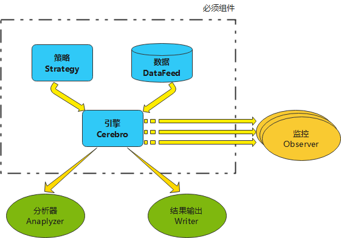
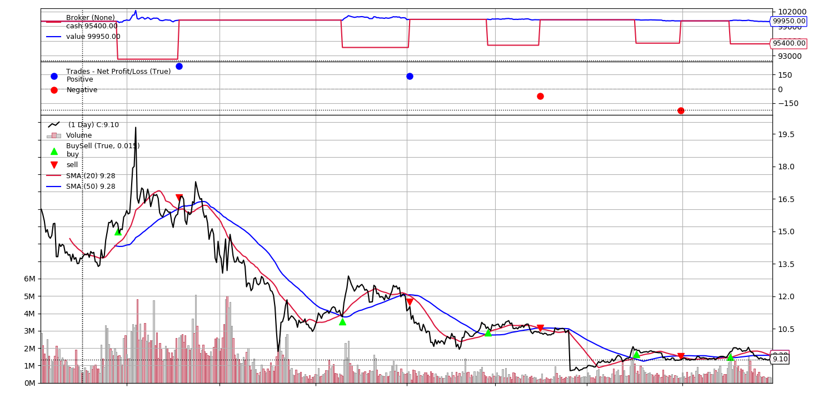

# 3 了解Bt的结构

本系列的第三部分，读完本章节可对BT主要类组件有个初步认识，然后通过一个最简单的双均线金叉死叉策略实例，演示各个组件模块起到的作用。

## BT主要类组件介绍

我将BT主要类组件分为“核心组件”和“增强组件”两类。“核心组件”是每个回测都必须有的组件，“增强组件”是提供各类可选增强服务的组件。下面是清单，后续将逐一进行介绍：

核心组件：

- Cerebro
- DataFeed
- Strategy
- Order / Trade
- Broker

增强组件：

- Indicators
- Anaplyzer
- Observer
- Opimiter（优化器）




### 核心1：Cerebro

bt.Cerebro（西班牙语意“大脑”）类是回测的总引擎，是组织各个部件的总程序入口。

Cerebro将各个组件组合搭建在一起，启动回测，返回回测的结果，并提供可视化等功能。

搭建回测结构的代码如下：

```python
# 添加数据
cerebro.adddata(data)
# 添加策略
cerebro.addstrategy(TestStrategy)
# 添加分析器
cerebro.addanalyzer(MyAnalyzer, _name='myanalyzer')
# 添加优化器...
strats = cerebro.optstrategy(TestStrategy, maperiod=range(10, 31))
```

获得回测结果与画图功能：

```python
# Run over everything
result = cerebro.run()
# 可视化输出
cerebro.plot()
```

### 核心2：Strategy

bt.Strategy类是用户策略的基类，开发者需要写一个继承bt.Strategy的子类，以实现交易逻辑。

Strategy有两个最重要的函数需override：

- \_\_init\_\_()
- next()

\_\_init\_\_()是在回测前对个性化数据进行计算；

next中存放针对每个Bar的交易逻辑指令，在next()中对情况进行判断并作出买卖指定。

### 核心3：DataFeed

DataFeed是可迭代的数据集合，类似于一组pandas.DataFrame。

平台默认支持的DataFeed有：

- CSV格式文件

- Yahoo在线数据

- Pandas DataFrames格式数据

- 从其他渠道来的数据（通过配置实现）

如何获取DataFeed对象将在本系列第四部分详细说明。

### 核心4：Order & Trade

逻辑指令的核心是下单，即对Order对象的处理。成对Order（开仓/平仓）撮合成交后可形成一个Trade。

BT支持不同类型的Order，将在本系列的第六部分中详细研究。

### 核心5：Broker

Broker是模拟交易市场的对象，其常用的要素有：现金(Cash)、手续费和滑点。

将在本系列的第五部分中详细研究。

### 增强类说明

促成我使用backtrader而不是自己写一个回测框架的重要理由是：bt内置了大量的现成组件，包括常用的指标（Incidator）、性能分析器(Analyzer)和参数优化器。更好的是bt的框架允许自己扩展上述类，以满足个性化的需求。

增强组件有很多，这里就不再一一说明。下面是一个简单的双均线金叉死叉策略的实现，代码中包括了上述这些类的基本使用方法，码农还是看代码比较有直观感受，对吧。

## 双均线策略示例

这里以最简单的双均线金叉死叉交易策略为例，演示bt中主要组件之间是如何相互协作的。

双均线金叉死叉策略，即看长、短两根移动平均均线的关系，如果短线上传长线则为金叉（买入），如短线下穿长线则为死叉（平仓）。

这里使用的数据是 平安银行A股2015、2016两年的数据，预先存放在本地csv文件中。

代码如下：

```python
import backtrader as bt
import bc_study.tushare_csv_datafeed as ts_df
import backtrader.analyzers as btanalyzers


class DoulbeSMAStrategy(bt.Strategy):
    """
    双均线金叉死叉策略
    """
    # 参数：长短均线的日期
    params = {"short_window": 20, "long_window": 50}

    def log(self, txt, dt=None):
        ''' log信息的功能'''
        dt = dt or self.datas[0].datetime.date(0)
        print('%s, %s' % (dt.isoformat(), txt))

    def __init__(self):
        # 一般用于计算指标或者预先加载数据，定义变量使用
        self.dataopen = self.datas[0].open
        self.dataclose = self.datas[0].close
        self.short_ma = bt.indicators.SMA(
            self.datas[0].close, period=self.p.short_window)
        self.long_ma = bt.indicators.SMA(
            self.datas[0].close, period=self.p.long_window)
        self.log("完成 长[{0}]短[{1}]SMA 数据的计算".format(self.p.short_window, self.p.long_window))

    def notify_order(self, order):
        # 订单状态变化：
        if order.status in [order.Completed]:
            if order.isbuy():
                self.log('BUY成交, 执行价={0}, {1}'.format(order.executed.price, order.executed.size))
            elif order.issell():
                self.log('SELL成交, 执行价={0}, {1}'.format(order.executed.price, order.executed.size))

    def notify_trade(self, trade):
        if not trade.isclosed:
            return

        self.log('交易结束, 毛利润 %.2f, 净利润 %.2f' %
                 (trade.pnl, trade.pnlcomm))

    def next(self):
        # 当前持有头寸
        size = self.getposition(self.datas[0]).size

        # 做多
        if size == 0 and self.short_ma[-1] < self.long_ma[-1] and self.short_ma[0] > self.long_ma[0]:
            # 开仓
            # self.order_target_value(self.datas[0]*, target=5)
            order = self.buy(size=100*5)
            self.log("金叉，买{0}, Short SMA yes={1}, Long SMA today={2}".format(order.size, self.short_ma[-1], self.long_ma[0]))
        # 平多
        if size > 0 and self.short_ma[-1] > self.long_ma[-1] and self.short_ma[0] < self.long_ma[0]:
            order = self.close(self.datas[0])
            self.log("死叉，卖{0}, Short SMA yes={1}, Long SMA today={2}".format(order.size, self.short_ma[-1], self.long_ma[0]))


if __name__ == '__main__':
    # 初始化引擎
    cerebro = bt.Cerebro()

    # 给Cebro引擎添加策略
    cerebro.addstrategy(DoulbeSMAStrategy)

    # 添加分析器
    cerebro.addanalyzer(btanalyzers.SharpeRatio, _name='mysharpe')

    # 设置初始资金：
    cerebro.broker.setcash(100000.0)    # 10万元

    # 从csv文件加载数据
    # 仅3天数据
    data = ts_df.get_csv_daily_data(
        stock_id="000001.SZ", start="20150101", end="20161231")
    cerebro.adddata(data)

    print('初始市值: %.2f' % cerebro.broker.getvalue())
    # 回测启动运行
    result = cerebro.run()
    thestrat = result[0]
    print('期末市值: %.2f' % cerebro.broker.getvalue())

    # 性能输出：
    print('夏普率:', thestrat.analyzers.mysharpe.get_analysis())

    # 绘图：
    cerebro.plot()
```

### 回测的输出

```text
初始市值: 100000.00
2016-12-30, 完成 长[20]短[50]SMA 数据的计算
2015-03-23, 金叉，买500, Short SMA yes=14.2995, Long SMA today=14.3224
2015-03-24, BUY成交, 执行价=15.43, 500
2015-05-21, 死叉，卖-500, Short SMA yes=16.078, Long SMA today=16.0268
2015-05-22, SELL成交, 执行价=15.91, -500
2015-05-22, 交易结束, 毛利润 240.00, 净利润 240.00
2015-11-02, 金叉，买500, Short SMA yes=11.112, Long SMA today=11.102
2015-11-03, BUY成交, 执行价=11.15, 500
2016-01-05, 死叉，卖-500, Short SMA yes=12.086500000000001, Long SMA today=12.0724
2016-01-06, SELL成交, 执行价=11.42, -500
2016-01-06, 交易结束, 毛利润 135.00, 净利润 135.00
2016-03-24, 金叉，买500, Short SMA yes=10.227, Long SMA today=10.2398
2016-03-25, BUY成交, 执行价=10.51, 500
2016-05-16, 死叉，卖-500, Short SMA yes=10.561, Long SMA today=10.5366
2016-05-17, SELL成交, 执行价=10.36, -500
2016-05-17, 交易结束, 毛利润 -75.00, 净利润 -75.00
2016-08-16, 金叉，买500, Short SMA yes=9.139, Long SMA today=9.1236
2016-08-17, BUY成交, 执行价=9.52, 500
2016-09-29, 死叉，卖-500, Short SMA yes=9.251000000000001, Long SMA today=9.2502
2016-09-30, SELL成交, 执行价=9.06, -500
2016-09-30, 交易结束, 毛利润 -230.00, 净利润 -230.00
2016-11-22, 金叉，买500, Short SMA yes=9.163, Long SMA today=9.1626
2016-11-23, BUY成交, 执行价=9.34, 500
2016-12-30, 死叉，卖-500, Short SMA yes=9.3, Long SMA today=9.277999999999999
期末市值: 99950.00
夏普率: OrderedDict([('sharperatio', -1.4980427196447035)])
```



### 回测结果分析

结果无疑是亏钱，亏了50元。夏普率 -1.49，是个风险大于回报的策略。

四次开仓交易，2次赚钱，2次亏钱，胜率50%。

两次亏钱都是在下行震荡行情中，如上图所示。

### 代码分析

- 策略类
  - 首先开发了一个bt.Strategy的子类DoulbeSMAStrategy
  - init函数中，添加了长短两根移动平均线指标
  - next中实现了买卖的逻辑，即金叉买，死叉卖。买卖的数量是人工计算，每次5手（500股）
- 引擎
  - 从csv文件中读取2年的数据，并通过cerebro.adddata加载到引擎中
  - 引擎添加了DoulbeSMAStrategy策略
  - 引擎添加了内置分析器SharpeRatio，并命名为mysharpe
  - 引擎设定了原始资金、然后就开始执行回测
  - 从回测结果对象中取出夏普分析器，输出最终的夏普率
  - 绘制图形
- Order和Trader
  - 在Strategy.next中，通过self.buy/close函数实现了下单，即生成Order
  - 通过实现两个notify_xxx函数，检测了order和trade对象的变化，及时输出了order的成交价格和trade的利润情况。

上述的代码使用了主要的类，未使用参数优化功能，未设置滑点、手续费等参数。

### 优化想法

这只是个演示代码，最终得到的是亏损。

如何优化上述策略算法，这里有几个思路：

**优化思路1：**

在第1个Trade期间，价格曾达到顶峰，但没有出现死叉所以没有卖。所以，设定一个止盈、止亏条件，以便于在急速上涨、下跌过程中，收获盈利、控制住损失。

如果读者有更好的优化思路，欢迎在回复中沟通。
