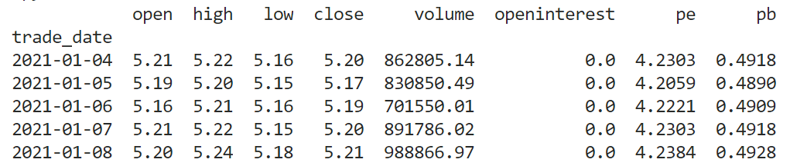

# 从自定义数据源取得Datafeed

框架自带的Datafeed工具尝尝不能满足实际需要，如增加一些列等。

最常见的数据来源，一是从自定义pd.Dataframe数据集，二是自定义的csv文件。本文着重说明如何将这两个数据来源，转换成bt的Datafeed。

其主要的思路是：

- 针对pd.Dataframe来源bt提供了backtrader.feeds.PandasData
- 开发者可开发一个类继承PandasData，并在这个类中声明字段信息
- csv也是同样的操作思路，可通过继承 backtrader.feeds.

## 一、pd.Dataframe数据源

需求：Datafeed中不仅有常规的价量数据，而且加上PE、PB两列；
数据格式：daily/600061.SH.csv存放日线数据，daily_basic/600016.SH.csv存放日线指标数据
代码说明：

- **拼接dataframe**

  - 使用pd.read_csv读取csv文件
  - 使用pd.merge拼接两个dataframe成一个df
  - 根据bt要求进行排序、列处理后返回dataframe，最终返回的dataframe如下：

  

- **自定义的Datafeed类**

  - 新建MyFeeddata类继承PandasData；
  - Override两个参数lines、params，注明新增列的类型与位置

- **添加自定义DataFeed**

  - 新建自定义的Datafeed
  - 策略大脑中添加数据源

### 完整代码示例

```python
#!/usr/bin/env python
# -*- encoding: utf-8 -*-
'''
@File    :   datafeed_by_my_dataframe.py
@Time    :   2021/01/11 10:46:21
@Author  :   Jeffrey Wang
@Version :   1.0
@Contact :   shwangjj@163.com
@Desc    :   示例：使用自定义的pd.Dataframe作为数据源

自定义的dataframe要求：
- 规定的列不能少；

实现的要点：
- 新建一个 PandasData 的子类 MyFeeddata；
- 子类中描述新增列的位置与列名。

'''
import backtrader as bt
import os
import datetime
import pandas as pd
from backtrader.feeds import PandasData


# 取得并返回自定义的pd.Dataframe
def get_df_data(stock_id):
    """取得DataFrame

    从股票日线、每日指标两个数据源读取，合并后返回需要的dataframe
    """

    # 文件:
    file_daily = os.path.join(
        'c:/fd_data/tushare/stock/daily/' + stock_id + ".csv")
    if not os.path.exists(file_daily):
        print("数据源文件未找到！" + file_daily)
        raise Exception("数据源文件未找到！" + file_daily)
    file_daily_basic = os.path.join(
        'c:/fd_data/tushare/stock/daily_basic/' + stock_id + ".csv")
    if not os.path.exists(file_daily_basic):
        print("数据源文件未找到！" + file_daily_basic)
        raise Exception("数据源文件未找到！" + file_daily_basic)

    # 将csv文件转为pandas.dataframe
    df_daily = pd.read_csv(filepath_or_buffer=file_daily, encoding="utf-8")
    df_daily_basic = pd.read_csv(
        filepath_or_buffer=file_daily_basic, encoding="utf-8")

    # 合并
    df = df_daily.merge(
        df_daily_basic[['trade_date', 'pe', 'pb']], how="left", on='trade_date')

    # 按日期先后排序
    df.sort_values(by=["trade_date"], ascending=True, inplace=True)
    # 将日期列，设置成index
    df.index = pd.to_datetime(df.trade_date, format='%Y%m%d')
    # 增加一列openinterest
    df['openinterest'] = 0.00
    # 取出特定的列
    df = df[['open', 'high', 'low', 'close', 'vol', 'openinterest', 'pe', 'pb']]
    # 列名修改成指定的
    df.rename(columns={"vol": "volume"}, inplace=True)

    # print(df.tail())
    return df


class MyFeeddata(PandasData):

    lines = ('pe', 'pb',)
    params = (('pe', 6), ('pb', 7),)

    # plotlines = dict(pe=dict(_name='Pe',
    #                          marker='o', color='blue',
    #                          markersize=8.0, fillstyle='full'))


class SimplePeStrategy(bt.Strategy):
    """简单市盈率策略
    """

    def __init__(self):
        self.dataclose = self.datas[0].close
        self.pe = self.datas[0].pe

    def log(self, txt, dt=None):
        dt = dt or self.datas[0].datetime.date(0)
        print("%s, %s" % (dt.isoformat(), txt))

    def next(self):
        self.log("收盘价 = {0:.2f}, PE = {1:.2f}".format(
            self.dataclose[0], self.pe[0]))


def run_backtest():
    """策略回测
    """
    # 初始化Cebro引擎
    cerebro = bt.Cerebro()

    # 给Cebro引擎添加策略
    cerebro.addstrategy(SimplePeStrategy)

    # 给Cebro引擎添加数据
    stock_id = "600016.SH"
    start_date = "20200101"
    end_date = "20201231"
    # 日期格式转换
    dt_start = datetime.datetime.strptime(start_date, "%Y%m%d")
    dt_end = datetime.datetime.strptime(end_date, "%Y%m%d")
    feed = MyFeeddata(dataname=get_df_data(stock_id),
                      fromdate=dt_start, todate=dt_end)
    cerebro.adddata(feed)

    # 设置初始资金
    cerebro.broker.setcash(100000.0)
    print("初始资金:%.2f" % cerebro.broker.getvalue())
    cerebro.run()
    print("期末资金:%.2f" % cerebro.broker.getvalue())

    cerebro.plot()
    # TODO 绘制pb的曲线


if __name__ == "__main__":
    # run_backtest()
    df = get_df_data("600016.SH")
    print(df.tail().head())

```


## 二、CSV文件数据源


