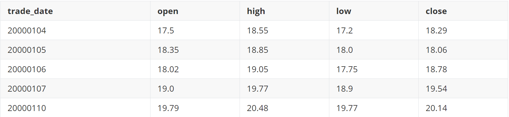
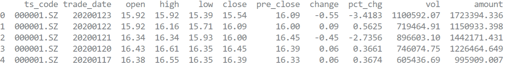

# 读取自己的数据源

工欲善其事必先利其器，策略回测最重要的是**数据**，backtrader的数据就是DataFeed对象。

本篇中将讨论DataFeed是什么、如何利用手头资源建立DataFeed。如何使用DataFeed部分将在本系列后续篇章中讨论。

## DataFeed是什么

我将DataFeed理解为一张二位表格（见下图），其中第一列是时刻（如日期），其余有价量数据。表中每一列称为Line，用户可以添加自己定义的Line。



我们有了DataFeed后，就可以通过Cerebro将数据加载，供其他模块使用。

```python
data = ts_df.get_csv_daily_data(stock_id="600016.SH", start="20190101", end="20190120")
cerebro.adddata(data)
```

## 怎么获得DataFeed？

backtrader可爱之处就是提供了很多方式生成DataFeed。下面几个例子，您可以根据自己手头数据情况，选择一种参考：

### 1. 我有规范的csv文件

这里的规范是指backtrader推荐的数据格式，称为Backtrader CSV，如果有符合格式的数据文件，则可以直接读取。

Backtrader CSV的格式要求如下：

- csv文件
- 按顺序包括以下列：
  - datetime列，格式为%Y-%m-%d %H:%M:%S
  - 数字列：open/high/low/close/volume/openinterest
  - 0的数字用0.00

如果有这样的文件，可以通过以下程序读取：

```python
# 使用您自己的文件路径替代：
data = bt.feeds.GenericCSVData(dataname='bc_study/demo/bt_csv_file.csv') 
...
cerebro = bt.Cerebro()
cerebro.adddata(data)
...
cerebro.plot()
```

小Tips，看是否正确读取了DataFeed，只要看最后的plot结果是否正确就好。

#### 个性化参数

通常这样严格定义格式的文件不好弄，而且用起来不方便，比如我们仅要回测一段时间的数据，不需要读取整个数据文件。

bt.feeds.GenericCSVData提供了很多参数，供用户描述自己文件的特殊情况。

可供调整的参数包括：起始时间、时间列的格式、各列的位置等。

列的参数规则如下：

- 默认是-1，表示根据列名自动匹配；
- 如果是None，表示没有这一列，或列在Index中（针对日期列）；
- 如果是>=0的数字，则表示在文件中的列位置，从0开始算；
- 如果是字符串，则表示所在列的列名

下面是一个例子，应该可以说明问题：

```python
# 起止时间
dt_start = datetime.datetime.strptime("20001219", "%Y%m%d")
dt_end = datetime.datetime.strptime("20001225", "%Y%m%d")

data = bt.feeds.GenericCSVData(
    dataname='bc_study/demo/bt_csv_file.csv',
    fromdate=dt_start,      # 起止日期
    todate=dt_end,
    nullvalue=0.0,
    dtformat=('%Y-%m-%d'),  # 日期列的格式
    datetime=0,             # 各列的位置，从0开始，如列缺失则为None，-1表示自动根据列名判断
    high=1,
    low=2,
    open=3,
    close=4,
    volume=5,
    openinterest=-1
)
```

每次都写一堆这样的定义也很麻烦。通常我们的数据格式都是相对固定的，我们可以写一个GenericCSVData类的子类来固化格式定义。

下面是一个例子：

```python

class MyCsvFileData(bt.feeds.GenericCSVData):
    # 自定义的文件格式

    params = (
        ('fromdate', datetime.datetime(2000, 1, 1)),
        ('todate', datetime.datetime(2000, 12, 31)),
        ('nullvalue', 0.0),
        ('dtformat', ('%Y-%m-%d %H:%M:%S')),
        # ('tmformat', ('%H.%M.%S')),
        ('nullvalue', 0.00),
        ('datetime', 0),
        ('high', 1),
        ('low', 2),
        ('open', 3),
        ('close', 4),
        ('volume', 'vol'),
        ('openinterest', -1)
    )

cerebro = bt.Cerebro()
# 从自定义类加载数据
data = MyCsvFileData(dataname='bc_study/demo/bt_csv_file.csv', start="20001219", end="20001225")
cerebro.adddata(data)
# 回测启动运行
cerebro.run()
cerebro.plot()

```

### 2. 我有互联网数据接口

backtrader目前能直接接入的接口包括：

- Yahoo接口（支持在线直连和存为本地csv文件两种模式）
- VisualChart接口

暂未使用，如有需要可参考：[Data Feeds - Backtrader](https://www.backtrader.com/docu/datafeed/#csv-data-feeds-common-parameters)

### 3. 其他数据源

backtrader能支持所有可转换成pandas.Dataframe格式的数据源，这真的是太爽了。

现实总是残酷的，实际使用下来，并不是所有的Dataframe都可以读取，其要求如下：

- 时间列，必须是index；
- 时间列，数据格式必须是datetime

 所以，要么使用bt.feeds.PandasData，要么自己写一个bt.feeds.PandasData的子类，描述数据要求。

以在线tushare A股日线数据接口为例，说明如何使用：

下图是从tushare上直接读出的dataframe数据格式：



使用bt.feeds.PandasData的代码：

```python
def get_tushare_data(start="20200101", end="20200131"):
    # 从tushare在线读取数据

    stock_id = "000001.SZ"
    start = "20190101"
    end = "20191231"
    dt_start = datetime.datetime.strptime(start, "%Y%m%d")
    dt_end = datetime.datetime.strptime(end, "%Y%m%d")
    TOKEN = 'xxxx'

    ts.set_token(TOKEN)
    pro = ts.pro_api()

    try:
        # 加载数据
        df = pro.daily(ts_code=stock_id, start_date=start, end_date=end)
        # 将日期列，设置成index
        df.index = pd.to_datetime(df.trade_date, format='%Y%m%d')
        print(df.head())

        data = TusharePdData(dataname=df, fromdate=dt_start, todate=dt_end)

        return data
    except Exception as err:
        print("下载{0}完毕失败！")
        print("失败原因 = " + str(err))
        
class TusharePdData(bt.feeds.PandasData):
    '''
    从Tushare读取A股票数据日线
    '''

    params = (
        ('datetime', None),
        ('open', -1),
        ('high', -1),
        ('low', -1),
        ('close', -1),
        ('volume', 9),
        ('openinterest', -1),
    )
```

## 扩展额外的列

回测用到的数据列不止OHLC这些，如果要加上额外的列，bt提供了方便的扩展方式。

下面的例子演示了如何加载csv数据文件中第8列的PE数据：

```python
# 定义我的DataFeed类：
from backtrader.feeds import GenericCSVData
import backtrader as bt

class GenericCSV_PE(GenericCSVData):

    # 说明列名是pe
    lines = ('pe',)

    # 定义pe所在的csv文件列位置，在第8列，即配置为9
    params = (('pe', 9),)


# 如何使用到pe列：
class MyStrategy(bt.Strategy):

    ...

    def next(self):

        if self.data.close > 2000 and self.data.pe < 12:
            # TORA TORA TORA --- Get off this market
            self.sell(stake=1000000, price=0.01, exectype=Order.Limit)
    ...

```
