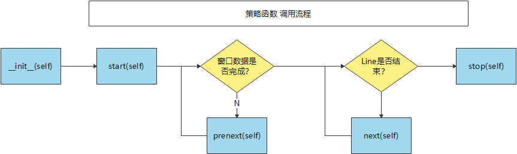
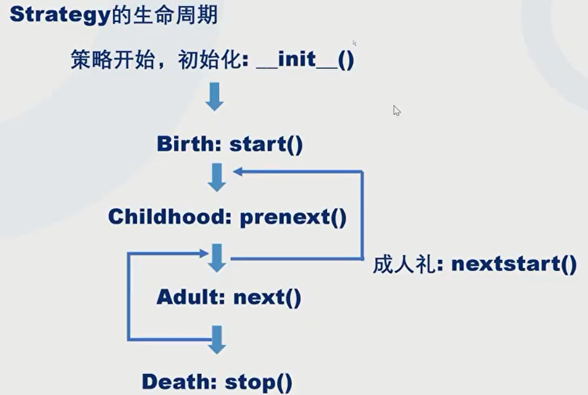

# 5 引擎和策略（Cerebro & Strategy）

这里我们将讨论backtrade的核心：Cerebro和Strategy。

Cerebro就是回测的调度者，负责组织各个模块进行协作。作为开发者，我们必须写一个继承Strategy的子类，实现具体的交易逻辑。

下面先讨论Strategy，即我们如何将交易想法用代码方式进行实现，然后再讨论Cerebro，即如何去执行回测的策略代码。

## 策略 Strategy

### 策略生命周期

我们已经知道要写一个继承自bt.Strategy的类。首先我们要明白重构哪些函数？这些函数的执行顺序是怎么样的？

下图描绘的是调用的顺序过程：



首先是init函数，通常我们会在此把所需要的数据完成计算，如先运算移动平均线等。

start()和stop()函数提供了整个大循环开始前和结束后的处理可能。比如我们可以在start()中模拟原始持仓情况，在stop()中把所有仓位平仓。

next()是最核心的函数，每一个bar生成后都会调用next()，这里可以写真正的交易逻辑。

prenext()是为哪些窗口函数准备的。比如我们在init()中计算一个20日的移动平均线，所以在回测开始的前19个交易日都不应进行逻辑处理，所以bt在前19个周期中调用prenext()函数，等到第20个周期才开始调用next()。





### 信息点 访问回测数据

在Cerebro中加载了回测数据DataFeed，在策略中可通过self.data访问数据。

有集中方式可访问数据：

- self.datas：是一个list，存放加载的多个Datafeed对象；
- self.data0 / self.data：是第一个DataFeed对象的引用；

每个DataFeed可通过索引访问，索引从0开始标识当前周期的数据，-1表示上一日的数据。为避免未来函数，索引不能为正数，即不能访问后续周期的数据。


#### len(self) 明确周期数

代码中可以通过len(self)确定目前是第几个周期，从1开始计数。len(self)不管prenext还是next都会计数加一。

下面是一个代码例子：

```python
class DoulbeSMAStrategy(bt.Strategy):
    ...

    def __init__(self):
        self.sma = bt.indicators.SMA(self.datas[0].close, period=3)

    def prenext(self):
        self.log("prenext(), len(self)={0}".format(len(self)))

    def next(self):
        self.log("next(), len(self)={0}".format(len(self)))
```

其输出：

```text
2015-01-05, prenext(), len(self)=1
2015-01-06, prenext(), len(self)=2
2015-01-07, next(), len(self)=3
2015-01-08, next(), len(self)=4
2015-01-09, next(), len(self)=5
```

### 策略参数

参数化可保持代码的灵活性。backtrader的策略参数建议在类参数params中定义，如：

```python
class DoulbeSMAStrategy(bt.Strategy):
	...
    params = {"short_window": 20, "long_window": 50}
    ...
```

调用参数可通过以下两种方式完成，其中 self.p是便捷用法：

```python
self.params.short_window
self.p.short_window
```

除了在策略定义中显示定义参数值外，可以在cerebro加载策略代码时，传入参数值，前提是该参数在策略代码中已定义：

```python
class DoulbeSMAStrategy(bt.Strategy):
	...
    params = {"window": 20, "p2": 1}
    ...

cerebro.addstrategy(DoulbeSMAStrategy, window=99, p2=10)
```

### 观察者模式

为监控策略运行情况，backtrader提供了三个监控函数，分别对于order状态、trade状态和现金便装情况进行监控：

- notify_order(self, order)
- notify_trade(self, trade)
- notify_cashvalue(self, vaule)

监控函数的用法、自定义开发监控将在后续篇章中讨论。

## Broker交易商

为模拟市场行为，所以有了模拟交易商的 Broker，下面将讨论几个问题。


### 回测结果

一个Strategy返回一个result对象，N个Strategy返回result的list。


### 现金

- 设置初始资金
- 读取现有现金头寸、市值
- 增加现金投入

### 滑点

滑点的示例

### 手续费

手续费的示例


？手续费


### Position

### Trade


```python

```
