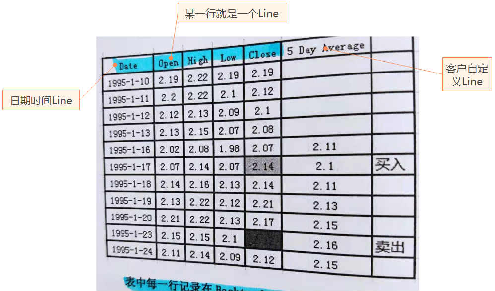

# 1.2 数据表的概念

Bt的数据表（DataFeed，或称策略迭代表），可以理解成一个pd.Dataframe样式的二维表。通常是下图的样子：

上图中：

- 每一个列就是一个Line，每一个行是一个时刻的数据称为Bar；
- 通常第一个Line是时间line；
- 除了基础的价量数据Line，也有一些自定义的Line。

## 1. next()函数访问未来数据

默认情况，next()中可以访问未来数据，在开发中需要避免这一操作！

完整的示例代码见：thinkinbt\p1\lines_shortcut.py

## 示例：从csp1v文件读取DataFeed

示例程序：thinkinbt/p1/read_datatable_from_csv.py

程序将从csv文件中读取并组合成DataFeed对象，最终通过bt展示策略运行结果图。
