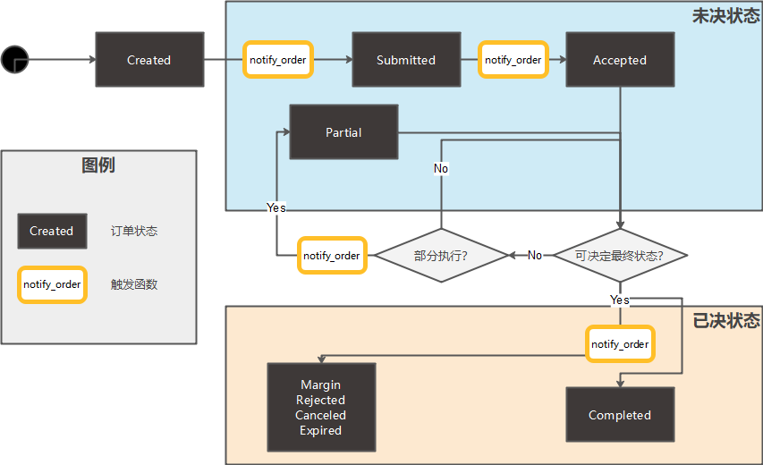

# Order和Trade的概念

订单(Order)是一次交易请求。默认都是市价单，会在下一个Bar按开盘价成交。

交易(Trader)是一次从建仓到空仓的完整交易。一个Trade可以包括一个或多个Order。

## 1. 订单的状态

订单状态变化规则如下图所示：

其中：

- 分为两类状态，"未决"和"已决"。其中未决状态如不清理，则会出现问题；
- 如果存在未决订单，则不能再创建其他任何订单。bt中没有做限制，需要自己实现。

Bt支持的订单状态如下：

- Created
- Submitted
- Accepted
- Partial
- Complete
- Rejected
- Margin
- Cancelled
- Expired

## 2. 未决订单的控制

如果存在未决订单，则不能再创建其他任何订单。bt中没有做限制，需要自己实现。

实现思路如下：

1. 在\_\_init\_\_()中设置一个 self.order = None；
2. 下单时，将生成的Order对象赋值到self.order中；
3. 在notify_order()中，如果是未决状态则不操作，如果是已决状态则将 self.order = None。

示例代码可参考：thinkinbt\p1\deal_pending_order.py

## 3. 不能做空情况下的Trader

## 附录 Order API

backtrader.Order

- 属性

  - ref ：唯一id
  - created ：创建信息
  - executed ： 执行信息

- 属性函数

  - isbuy ：bool 是否买单
  - issell ：bool 是否卖单
  - alive ：bool 如果状态是Partial或Accepted，返回True

- 方法

  - execute 执行

## 附录 Trader API

