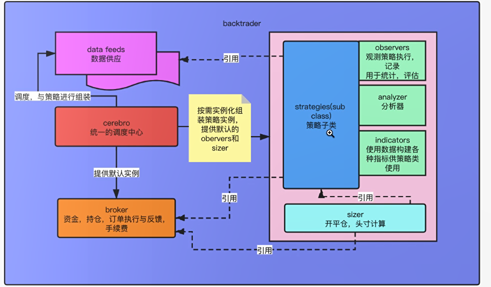

# BackTrader 学习笔记


## 总结构





## 引擎 Cerebro

Cerebro在西班牙语是大脑的意思，Cerebro是BT的核心类。

Cererbro的职责有几点：

1. 收集资料，构建框架；包括收集数据（DataFeed），组装构建（Strategies、Observers、Analyzers）
2. 执行回测/交易
3. 返回结果
4. 构建图形化输出。


### 回测结果

回测执行（cerebro.run）将返回一个回测结果对象的list。当参数优化执行后将返回多个结果的list，普通回测执行返回单个结果的list。

### 结果的可视化展示

bt集成了matplotlib类库，可直接输出图形化报表。

目前，直接执行会发生错误，报错内容如下：

```
Traceback (most recent call last):
  File "c:/github/shwdbd/backtrader_study/bc_study/quickstart_demo0.py", line 29, in <module>
    cerebro.plot()
  File "C:\Python\venv\bt_study\lib\site-packages\backtrader\cerebro.py", line 970, in plot
    if self._exactbars > 0:
AttributeError: 'Cerebro' object has no attribute '_exactbars'
```

### 回测处理逻辑

回测的基本流程如下：

1. 准备数据，包括数据包的加载、预计算等；
2. 从DataFeed提供下一个Bar数据（访问指针移动）
3. 通知 Order、Trade、Cash/Value等模块，启动业务处理
4. 通知Broker处理排队的Order（业务撮合）
5. 调用策略的next方法；
6. 告知Writer模块，写日志。
7. 重复执行 2 - 6 步骤，直到将全部Bar处理完毕。


### 主要类的API

#### class backtrader.Cerebro()

属性：

```
preload = True		# 预加载数据
runonce = True		# 指标(Indicators)使用向量化计算
live = False		# 采用live处理数据
...
```

方法：

```
adddata(data, name=None)	# 添加DataFeed

addstrategy(strategy, *args, **kwargs)	# 添加策略class

optstrategy(strategy, *args, **kwargs)	# 添加优化策略class
# 如：cerebro.optstrategy(MyStrategy, period=range(15, 25))

run(**kwargs)		# 策略运行
# 如没有data，则直接结束运营
# 如果非优化模式，则每个addstrategy返回一个result
# 如果优化模式，则每个addstrategy返回一组result

plot(plotter=None, numfigs=1, iplot=True, start=None, end=None, width=16, height=9, dpi=300, tight=True, use=None, **kwargs)
# 绘图

```


## 数据源 DataFeed


## 策略基类 Strategy


### 策略长度 len(self)

策略的长度（len(self)）等于其已处理数据Bar的数量，即第一个next中等于1，第N个next中等于n。


### Strategy属性


```
env:Cerebro		# 对Cerebro引擎的引用

datas:			# 数据DataFeed的Array，
data			# datas[0]
dataX			# datas[x]

dnames			# 按名称查找DataFeed
# smadays = bt.ind.SMA(self.dnames.days, period=30)  # or self.dnames['days']

broker

position		# data0的头寸信息


```


## 指标


## Orders


## Brokers


